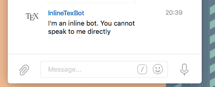

# InlineLaTeX
A LaTeX-producing inline bot for Telegram Messenger.

The bot is online. Try by querying `@inlinetexbot`.
If all goes right, you'll be seeing something like this: .

## The source
InlineLaTex relies on the async version of the `telepot` libraries. See that module's
[documentation](https://github.com/nickoala/telepot) for more details. Because of my use of the `async-await` syntax,
InlineLaTex requires Python 3.5.

## Getting it to work
To run this script on your own, you will need a web server to host any generated latex-carrying images. This is
necessary: as of February 22, 2016, inline bots cannot directly send images over Telegram. However, they may send
image urls. A (possibly different) computer will need to run the InlineLaTeX script. This computer will need a
working version of Python 3.5, a LaTeX distribution with the `pdflatex` tool installed, and the `gs` (GhostScript)
utility for converting the output pdf.

1. Register a Telegram bot at [Botfather](https://core.telegram.org/bots). Indicate that your bot will respond to
   inline queries. Take note of your access token.
2. Paste your access token, as well as your credentials into the 'sample_config.json' file. Rename this file to
   `config.json` (or point the corresponding variable to your file in 'config_reader.py')
3. Run the script: `python3.5 inlinetexbot.py`.
4. To enable more detailed logging, change log-levels to `DEBUG` in the
   `linlinetex_loggers.py` file.
